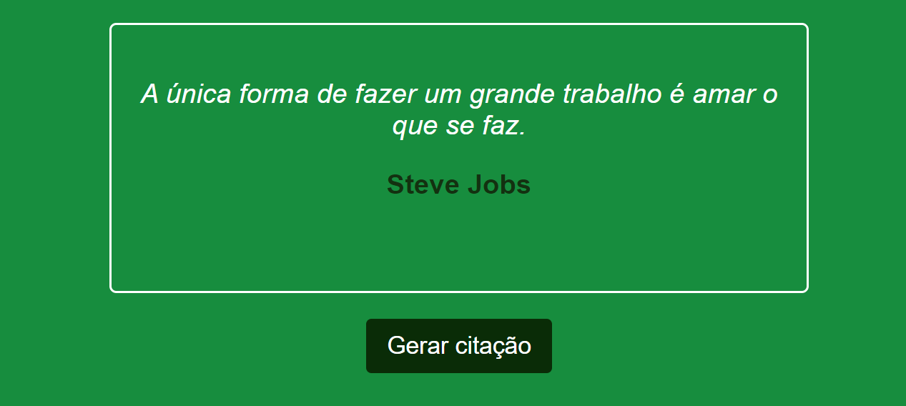

# quotes

## 🖥️ Projeto

Projeto Citações. É um gerador de citações aleatórias. Teremos os dados mocados e quando clicamos no botão de citação, é buscado esses dados como se fosse num "banco de dados" e nos traz uma citação no front-end.

## 🚀 Tecnologias

Esse projeto foi desenvolvido com as seguintes tecnologias:

- HTML
- CSS
- JavaScript
- Git e Github
